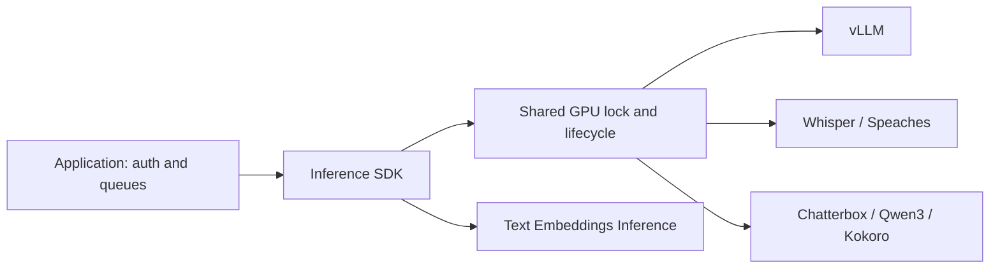

# Inference SDK: GPU orchestration for LLMs and speech

Run self-hosted language, speech and embedding models from a TypeScript worker with one GPU lifecycle owner. `@bitdeep/inference-sdk` coordinates demand loading, idle unloading, speech references and inference requests while your application owns authentication, queues and customer data.

[](https://github.com/bitdeep/gpu-worker-orchestrator/releases)
[](LICENSE)

**Start here:** [Use the SDK](#use) · [Supported engines](#supported-operations) · [Architecture](https://github.com/bitdeep/gpu-worker-orchestrator/blob/main/docs/architecture.md) · [Work with me](#work-with-me)

## Why use it

Running each model successfully does not mean they fit together. A Whisper transcription can leave its model resident just before a voice model needs the same GPU memory. An idle timer can also interrupt a long generation if it does not share the request lock.

This SDK makes those transitions explicit: one process owns GPU operations, heavy voice models yield before ASR, and Speaches can release Whisper before voice synthesis. It combines **LLM inference, speech-to-text and text-to-speech** behind a small application boundary.

The SDK has no third-party runtime dependencies. Node 26 is required; FFmpeg must be available in the worker image for WAV-to-MP3 conversion and multi-part speech.

The lifecycle design behind this SDK, with measured handoffs on a shared GPU, is chapter 04 of the [garage-inference book](https://github.com/bitdeep/garage-inference/blob/main/04-gpu-lifecycle/README.md).



## Use

Download the compiled SDK from [GitHub Releases](https://github.com/bitdeep/gpu-worker-orchestrator/releases). Check the archive against `SHA256SUMS`, extract it, then verify its files against the included `MANIFEST.json`. Pin the version and manifest hash in your application's dependency import process. This package is not published to npm.

To build it yourself, use a Node 26 development container with pnpm 11.24.0 and your dependency review policy enabled:

```sh
pnpm install --frozen-lockfile --ignore-scripts
pnpm typecheck
pnpm test
pnpm build
pnpm release:local
```

`release:local` produces a directory under `artifacts/` containing compiled JavaScript, declarations, package metadata, licensing and a SHA-256 manifest. Install or vendor that directory in your private application; pin its manifest hash. It contains no model weights or deployment configuration.

```ts
import { createInferenceRuntime } from "@bitdeep/inference-sdk";

const inference = createInferenceRuntime({
  llm: { url: "http://llm:8000", model: "local-llm" },
  asr: { url: "http://asr:8000", model: "Systran/faster-whisper-small" }
});

const answer = await inference.chat(
  [{ role: "user", content: "Say hello in Portuguese." }],
  32
);
const transcript = await inference.transcribe(wavBuffer, "audio/wav", {
  language: "pt"
});
inference.close();
```

## Managed GPU lifecycle

Supply a container controller explicitly to start and stop containers already provisioned by your private deployment:

```ts
import { createDockerController, createInferenceRuntime } from "@bitdeep/inference-sdk";

const inference = createInferenceRuntime({
  llm: {
    url: "http://llm:8000", model: "local-llm",
    container: "example-llm-1", keepWarm: true
  }
}, {
  containers: createDockerController({ containers: ["example-llm-1"] }),
  onEvent: event => console.log(event)
});
await inference.startIdleUnloader();
await inference.warmup();
```

The controller permits only inspect/start/stop for the configured names. The Docker socket remains privileged: its mount belongs in a trusted worker, never a public request handler. A controller supplied by your deployment can enforce a narrower remote capability instead.

Use one runtime owner per GPU. Requests and idle checks share a process-local lock; this is not a distributed GPU scheduler. `withExclusiveGpu()` releases managed heavy voice engines and the managed LLM for a batch operation, then restores a keep-warm LLM.

## Supported operations

| Operation | Engine contract | Behavior |
|---|---|---|
| `chat` | OpenAI-compatible chat completions, tested with vLLM | Structured JSON, timeout, cancellation |
| `transcribe` | Speaches/Whisper multipart transcription | VAD, confidence filtering, prompt/hotword forwarding, retries |
| `synthesize` | OpenAI speech, Chatterbox, Qwen3-TTS | Reference registration, chunking, MP3 normalization |
| `embed` | Text Embeddings Inference `/embed` | Batched inputs and validated vector response |
| `withExclusiveGpu` | Caller-supplied batch operation | Serialized release and restore |

For speech, configure `tts` with `id`, `kind`, `url`, `container` (empty for externally managed), `model`, `voice` and `idleMs`. Qwen3 cloning requires reference text; the SDK can transcribe it using its ASR endpoint. Chatterbox references use its upload/list contract. The reference ID must identify the audio content (for example its SHA-256).

For OpenAI-compatible speech such as Kokoro, the request's `voice` takes precedence over the
engine's configured default. The returned `voice` identifies the selection sent to the server.

When Speaches shares a GPU with Chatterbox or Qwen3, set `asr.unloadBeforeHeavyTts: true`. After reference transcription, the SDK releases the resident Whisper model through Speaches' `/api/ps/{model_id}` endpoint before starting heavy speech inference, under the same GPU lock. Cached weights remain on disk and the next transcription reloads them. Leave this option disabled for ASR servers without that lifecycle API.

Voice caches belong to a runtime instance and endpoint. A shared server and reference volume are still a shared trust boundary: separate them between customers. Lifecycle events omit prompts, audio, credentials and upstream response bodies. Credentials can be supplied to LLM/ASR/embedding endpoints through a caller-owned `headers()` function.

## Deployment boundary

The reusable engine recipes live in the companion projects `vllm-serving-stack`, `whisper-asr-stack` and `chatterbox-ptbr-server`. Applications extend their Compose services and supply private networks, volumes, resource overrides, identities and credentials.

This repository contains neither a hub protocol nor an application queue. Its tests exercise adapters, reference handling, cancellation, GPU serialization and idle behavior. They do not establish throughput or hardware compatibility; measure those on the deployment hardware.

After building, run `pnpm test:audio` in a container with FFmpeg to verify real conversion, concatenation and failure diagnostics using a generated tone.

The initial implementation passed 60 unit tests, real FFmpeg conversion/concatenation checks, and a synthetic GPU flow covering chat, Kokoro, Chatterbox, Whisper and Qwen3, including ASR reload after voice synthesis. Embeddings and batch are covered by contract tests; that GPU flow does not establish their performance.

## Companion stacks

| Project | Use it for |
|---|---|
| [Chatterbox PT-BR](https://github.com/bitdeep/chatterbox-ptbr-server) | Brazilian Portuguese voice cloning over HTTP |
| [vLLM serving stack](https://github.com/bitdeep/vllm-serving-stack) | OpenAI-compatible LLM serving with explicit FP8 and memory settings |
| [Whisper ASR stack](https://github.com/bitdeep/whisper-asr-stack) | Speech recognition and corrected Speaches model unload |

For `unloadBeforeHeavyTts`, use the companion Whisper image: it fixes explicit-unload locking and alias resolution in the pinned Speaches base.

## Work with me

I build inference infrastructure that connects models to real applications: GPU lifecycle coordination, LLM serving, speech pipelines and deployment validation. For consulting or engineering opportunities, [contact bitdeep on X](https://x.com/_wrbr).

For reproducible bugs or feature requests, [open an issue](https://github.com/bitdeep/gpu-worker-orchestrator/issues) with the SDK version, engine versions and a synthetic reproduction. Keep customer data and credentials out of public issues.
