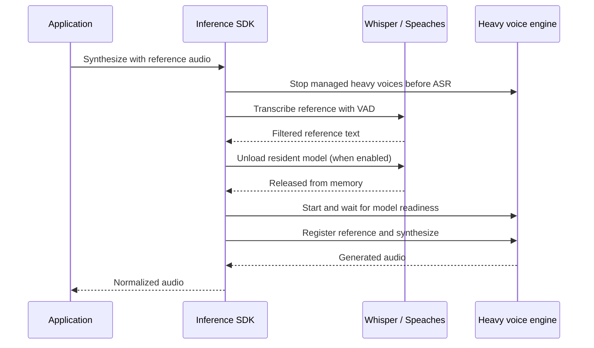

# How the inference SDK manages a shared GPU

The SDK separates application policy from model execution. An application supplies endpoints, models, container names and callbacks. It keeps its own authentication, queues, prompts, storage and customer identity.

## One owner, one lock

Create one runtime for each GPU owner. Chat, transcription, voice synthesis, idle checks and exclusive batch operations share a process-local promise queue. A failed request releases the queue so the next operation can proceed. This is not a distributed scheduler; two independent workers cannot coordinate a GPU through this lock.

Idle clocks are updated when generation completes. The idle sweep uses the same lock, so a long generation cannot be stopped halfway through by its own idle timer.

## Speech reference handoff

Qwen3 cloning needs a reference transcript. When it is absent, the SDK transcribes the reference before acquiring the synthesis lock, avoiding recursive acquisition of the same lock.

On the next transcription, a managed heavy voice engine yields again. Cached model weights stay on disk; GPU residency changes. The companion [Whisper stack](https://github.com/bitdeep/whisper-asr-stack) fixes a lock re-entry deadlock and model alias resolution in its pinned Speaches image so explicit unload can complete.

An unload failure stops the heavy synthesis path before it starts another model. The error exposes the HTTP status, not the upstream response body.

## Boundaries that remain explicit

| Boundary | Owner |
|---|---|
| Authentication, authorization and customer separation | Application |
| Queue leases, cancellation policy and retries around jobs | Application |
| Model requests, reference adaptation, VAD confidence gate | SDK |
| Allowed container names and start/stop capability | Deployment, injected into SDK |
| Model weights and reference audio storage | Deployment |
| Actual free memory, engine health and performance measurement | Deployment operator |

The Docker controller uses an allowlist, but mounting the Docker socket still grants significant host authority. Run the controller in a trusted worker or provide a narrower controller implementation.

Reference caches belong to a runtime and endpoint. A shared reference volume remains a shared trust boundary; use separate instances and volumes where customers must be isolated.

## Evidence and limits

The tests cover serialization, recovery after failure, idle behavior during generation, reference requirements, per-endpoint caches, cancellation, structured chat, Docker allowlists and failed ASR release. The audio integration check uses a generated tone with real FFmpeg.

The synthetic GPU smoke exercised chat and three voice engines, transcription of generated references, model release and ASR reload. It demonstrated the handoff behavior; it is not a WER, speech-quality, latency or throughput benchmark. Reproduce measurements on your hardware with a declared workload before using them for capacity planning.
